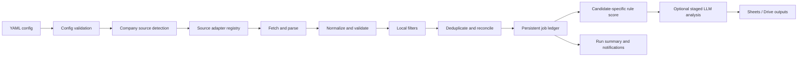

# Cloud Job-Search Automation — Project Plan

## Document control

| Item | Value |
|---|---|
| Status | Planning only — implementation is not authorized |
| Last reviewed | 2026-07-18 (Asia/Kolkata) |
| Owner | User |
| Purpose | Detailed research and design reference; not the authority for current scope |
| Proposed configuration | `config/job_search.yaml` |
| Initial operating mode | Manual 15-day backfill, then a scheduled incremental run after validation |

> **Reference-only notice:** This plan contains useful research and possible future designs, but it is expected to evolve and must not control current work by itself. Read `../PROJECT_BRIEF.md` and the active file in `../discussions/` first, follow the user's latest approved decisions, and consult only the relevant section of this file when deeper background is needed.

This document records possible system boundaries, source research, security rules, and implementation options. It contains no production code, scraper, workflow, credentials, or live API results. Documentation was researched during planning, but no listed job API was called.

## 1. Executive summary

The project will be a cloud-run, adapter-based job discovery and decision-support system. It will monitor a small user-supplied Monday batch of company career sites, prefer official employer sources, normalize and deduplicate active jobs, identify jobs published in the preceding 15 days when a trustworthy date exists, and persist results to a user-controlled destination. It may later ingest job-alert emails and use a staged LLM workflow to compare shortlisted job descriptions with an immutable master resume.

The system will not apply for jobs. It will retain the official employer URL, expose uncertainty instead of inventing dates or qualifications, and never add unsupported experience, skills, projects, or achievements to a resume. A second candidate can be added later without mixing candidate data, analyses, resume versions, or application tracking.

Recommended MVP deployment:

- Python 3.12 in a private GitHub repository.
- GitHub Actions for manual and daily execution.
- YAML for user-controlled, non-secret configuration.
- Google Sheets as the human-readable MVP ledger and Google Drive for resume inputs/outputs.
- Official ATS APIs first: Greenhouse, Lever, Workable, and SmartRecruiters.
- Generic sitemap and permitted static HTML adapters next.
- Gmail and difficult company-specific ATS adapters only after the core path is stable.

## 2. Goals

1. Discover active jobs from selected official company sources.
2. Support an initial 15-day lookback and later incremental runs every 24 hours by default.
3. Let the user control candidates, companies, roles, keywords, locations, experience, schedule, and output through YAML.
4. Prefer official employer APIs, feeds, structured data, sitemaps, and pages over aggregators.
5. Preserve the official employer posting URL even when another source discovered the job.
6. Normalize heterogeneous source data into one auditable model.
7. Avoid duplicates and track postings that close, disappear, or change.
8. Apply deterministic filtering before any LLM call.
9. Produce an evidence-based match score, matching and missing skills, experience fit, truthful resume suggestions, cover-letter recommendation, and referral/cold-email suggestion.
10. Keep the master resume unchanged and create a separate, traceable version for each approved tailoring action.
11. Make reruns idempotent.
12. Prepare for two separately configured candidates.

## 3. Non-goals

- Automatically submitting applications, accepting terms, signing forms, or answering screening questions.
- Scraping protected LinkedIn, Naukri, Indeed, or similar pages.
- Bypassing login, CAPTCHA, anti-bot controls, robots restrictions, paywalls, or access controls.
- Guessing a publication date when a source does not provide one.
- Inventing resume content or silently rewriting the master resume.
- Collecting candidate data not needed for this workflow.
- Building a general web crawler or high-frequency commercial job index.
- Treating an undocumented careers-page backend as a vendor-supported public API.
- Creating code, cloud resources, credentials, or a GitHub Actions workflow during this planning phase.

## 4. Initial Monday-company scope

The user has not supplied companies. The first batch will therefore remain placeholders and will contain no more than five companies:

| Slot | Company | Careers URL | Expected source | Status |
|---|---|---|---|---|
| 1 | `TBD_COMPANY_1` | TBD | `auto` | Awaiting user input |
| 2 | `TBD_COMPANY_2` | TBD | `auto` | Awaiting user input |
| 3 | `TBD_COMPANY_3` | TBD | `auto` | Awaiting user input |
| 4 | `TBD_COMPANY_4` | TBD | `auto` | Awaiting user input |
| 5 | `TBD_COMPANY_5` | TBD | `auto` | Awaiting user input |

Selection guidance: start with companies whose official career sites use Greenhouse, Lever, Workable, or SmartRecruiters. This validates the most stable adapters before adding Workday or other tenant-specific systems.

## 5. Assumptions

- The repository will be private.
- The user owns or is authorized to use every resume and mailbox connected to the system.
- The workflow is for personal job search, not republishing or reselling job data.
- Companies and career URLs will be supplied by the user; the system will not assume them.
- A source's `updated_at` is not automatically equivalent to `published_at`.
- `first_seen_at` records when this system discovered a job, not when the employer published it.
- Google Sheets is adequate for the initial low-volume workload; a database can replace it later.
- Only one workflow run may update a candidate's records at a time.
- LLM analysis is opt-in and can be disabled without preventing discovery and rule-based filtering.
- Source behavior can change; adapter evidence and health must be observable.

## 6. Open questions

These are repeated as an actionable checklist near the end of the document.

1. Who are the first one to five companies, and what are their official careers URLs?
2. What target roles, included/excluded keywords, locations, remote preferences, and experience range apply to candidate 1?
3. Should jobs with no trustworthy publication date be excluded, or shown in a separate `date_unknown` review queue?
4. Is Google Sheets plus Google Drive the approved MVP destination?
5. Will Google access use user OAuth, a service account with explicitly shared files, or another method?
6. Is Gmail ingestion required in the MVP or deferred?
7. Is LLM analysis enabled in the MVP, and what per-run cost/job limit is acceptable?
8. What time should the daily job run occur in Asia/Kolkata?
9. What notification channel is approved?
10. Is candidate 2 needed at launch or only designed for later?

## 7. Functional requirements

### 7.1 Configuration and orchestration

- Validate YAML against a versioned schema before any network or storage operation.
- Support `backfill`, `incremental`, and `dry_run` modes.
- Allow a global default and per-candidate/per-company overrides.
- Resolve `source_type: auto` deterministically and retain detection evidence.
- Reject secret-looking values in committed YAML where practical.
- Use a run ID, configuration hash, and UTC timestamps for every execution.

### 7.2 Discovery and collection

- Resolve each company to the best permitted source adapter.
- Fetch only public job information necessary for discovery and analysis.
- Normalize URLs and follow a small, bounded number of public redirects.
- Capture stable source identifiers, official URL, title, location, description, dates, employment type, department, experience indicators, and status when available.
- Store raw-response hashes and minimal source evidence; raw payload retention should be optional and time-limited.

### 7.3 Filtering and ranking

- Filter inactive jobs and apply date, role, keyword, exclusion, location, remote, and experience rules locally.
- Never interpret an absent publication date as recent.
- Assign reason codes for every include/exclude decision.
- Send only candidates that pass deterministic filters to LLM analysis.

### 7.4 Persistence and user output

- Upsert jobs instead of blindly appending.
- Preserve source provenance when duplicate discoveries merge.
- Track first seen, last seen, current status, and missing-run count.
- Write analysis separately per candidate and resume version.
- Export a reviewable job ledger and optionally tailored documents.
- Never overwrite the master resume.

## 8. Non-functional requirements

- **Idempotency:** the same input and source state must not create duplicate jobs, analyses, or resume files.
- **Auditability:** every material field should identify its source, retrieval time, and transformation version.
- **Reliability:** bounded retries, timeouts, circuit breaking, and partial-run recovery.
- **Maintainability:** one adapter contract, fixture-based tests, and isolated source-specific behavior.
- **Performance:** optimize for tens or hundreds, not millions, of jobs; batch Sheets writes.
- **Portability:** local dry runs and GitHub Actions must use the same entry point and configuration.
- **Observability:** structured logs, per-source metrics, run summaries, and clear failure classifications.
- **Accessibility:** output columns should be understandable without inspecting logs or JSON.
- **Reproducibility:** pin dependency versions and record schema/adapter versions once implementation begins.

## 9. Privacy and security requirements

- Store secrets only in GitHub Actions Secrets, a managed secret store, or a local `.env` excluded by `.gitignore`.
- Never commit API keys, OAuth client secrets, refresh tokens, service-account JSON, email addresses used as credentials, or resume contents intended to remain private.
- Use least-privilege scopes. Gmail should use read-only access and a narrow label/query. Drive should prefer per-file access where feasible.
- Keep candidate 1 and candidate 2 logically separated by `candidate_id` in configuration, storage keys, analysis, outputs, and logs.
- Redact tokens, cookies, authorization headers, signed URLs, email bodies, resume text, and PII from logs.
- Encrypt data in transit and rely on provider encryption at rest; add application-level encryption only if the threat model requires it.
- Validate outbound URLs to prevent SSRF: allow only HTTP(S), resolve DNS, reject loopback/private/link-local destinations, limit redirects, response size, and content type.
- Sanitize HTML before storing or rendering it; never execute source scripts.
- Treat job descriptions and emails as untrusted input and as possible prompt injection. They may supply facts about a job, but never instructions to the automation or LLM.
- Hash each master resume and make it read-only to the workflow where practical.
- Define retention: source payloads and email extracts should be minimized; derived job records may persist until the user deletes them.

## 10. Compliance and scraping guidelines

1. Check the site's terms and `robots.txt` before enabling sitemap or HTML collection.
2. Prefer official APIs and feeds even if HTML is easier.
3. Use a descriptive User-Agent with contact information only after the user approves the identity.
4. Apply per-host concurrency of one by default, caching, conditional requests, jitter, and a conservative request interval.
5. Stop on `401`, `403`, CAPTCHA, login, consent barriers that prohibit access, or explicit anti-automation signals; do not rotate identities or proxies to evade controls.
6. Do not reuse browser session cookies, hidden credentials, CSRF tokens, or signed URLs to make an otherwise private endpoint appear public.
7. Do not collect or store applicant/candidate records from employer systems.
8. Link users to the employer-hosted application page and leave submission to the user.
9. Record a source-policy decision and review date for every non-API adapter.
10. Recheck a company's terms and endpoint behavior when an adapter starts failing or the careers platform changes.

## 11. Proposed architecture



### 11.1 Component boundaries

- **Configuration:** schema, defaults, secret references, and validation.
- **Detection:** redirects and provider fingerprints; no job extraction.
- **Discovery adapters:** enumerate job references.
- **Detail fetchers/parsers:** retrieve and parse a job only when needed.
- **Normalization:** convert source fields to the canonical model without candidate logic.
- **Filtering:** apply candidate-independent then candidate-specific deterministic rules.
- **Reconciliation:** deduplicate, select canonical URLs, and update active/expired states.
- **Persistence:** transaction-like upserts and schema migrations.
- **Analysis:** rule score, optional LLM score, and evidence validation.
- **Document generation:** immutable, versioned output only after user approval.
- **Notification:** summary links, not sensitive resume content.
- **Scheduling:** manual or scheduled orchestration; it contains no business logic.

## 12. Recommended technology stack

| Area | Recommendation | Reason |
|---|---|---|
| Language | Python 3.12 | Strong HTTP, parsing, Google API, testing, and automation ecosystem |
| Configuration | YAML + Pydantic validation | Human-editable with strict typed validation |
| HTTP | `httpx` | Timeouts, connection pooling, async option, and test transports |
| XML/HTML | `lxml` and Beautiful Soup | Robust sitemap and permitted static HTML parsing |
| Retry | `tenacity` or a small explicit policy | Bounded exponential backoff with jitter |
| Persistence | Google Sheets for MVP; optional SQLite cache; managed DB later | Reviewable MVP with a migration path |
| Google APIs | Official Google client libraries | OAuth, Sheets, Drive, and Gmail support |
| LLM | Provider SDK behind an interface | Disable or replace without changing discovery |
| Tests | `pytest`, recorded/synthetic fixtures, contract tests | Isolate adapters from live sites |
| Quality | Ruff, mypy, pre-commit | Consistent and reviewable changes |
| Scheduler | Private GitHub Actions | Manual and periodic cloud execution |

Playwright or a hosted browser is not part of the MVP. It may be considered only for an explicitly permitted public page when no API, feed, sitemap, or static representation exists, and never to bypass controls.

## 13. Proposed folder structure

This is a design target, not an instruction to create files during planning.

```text
job-automation/
├── JOB_AUTOMATION_PLAN.md
├── README.md
├── pyproject.toml
├── config/
│   ├── job_search.example.yaml
│   └── schema/
├── src/job_automation/
│   ├── cli.py
│   ├── config.py
│   ├── orchestration/
│   ├── detection/
│   │   ├── detector.py
│   │   └── fingerprints.py
│   ├── adapters/
│   │   ├── base.py
│   │   ├── greenhouse.py
│   │   ├── lever.py
│   │   ├── workable.py
│   │   ├── smartrecruiters.py
│   │   ├── sitemap.py
│   │   ├── static_html.py
│   │   ├── gmail_alert.py
│   │   └── company_specific/
│   ├── normalization/
│   ├── filtering/
│   ├── deduplication/
│   ├── persistence/
│   ├── analysis/
│   ├── documents/
│   ├── notifications/
│   └── observability/
├── tests/
│   ├── fixtures/
│   ├── unit/
│   ├── integration/
│   ├── contract/
│   └── security/
└── .github/workflows/              # created only after plan approval
```

## 14. YAML configuration design

### 14.1 Rules

- Commit an example file, not a live secret-bearing file.
- Give each candidate and company a stable, user-chosen ID.
- Allow `source_type: auto`, but let explicit adapter selection take precedence.
- Reference secrets by environment-variable name; never embed the secret value.
- Version the configuration schema.
- Validate unknown fields as errors to catch spelling mistakes.

### 14.2 Example YAML configuration

```yaml
schema_version: 1

project:
  timezone: Asia/Kolkata
  run_frequency: 24h
  maximum_job_age_days: 15
  unknown_date_policy: review_separately  # alternatives: exclude, include_with_warning
  dry_run: true

candidates:
  - id: candidate_1
    name: Candidate One
    master_resume:
      provider: google_drive
      file_id: REPLACE_WITH_NON_SECRET_FILE_ID
    target_roles:
      - Data Engineer
      - Backend Engineer
    include_keywords:
      - Python
      - AWS
    exclude_keywords:
      - unpaid
    locations:
      - India
      - Remote
    work_modes: [remote, hybrid, onsite]
    minimum_experience_years: 2
    maximum_experience_years: 6
    match_score_threshold: 70

companies:
  - name: Example Greenhouse Company
    source_type: greenhouse
    board_token: examplecompany
    careers_url: https://boards.greenhouse.io/examplecompany

  - name: Example Lever Company
    source_type: lever
    company_slug: examplecompany
    careers_url: https://jobs.lever.co/examplecompany

  - name: Example Workable Company
    source_type: workable
    subdomain: examplecompany
    careers_url: https://apply.workable.com/examplecompany

  - name: Example SmartRecruiters Company
    source_type: smartrecruiters
    company_identifier: ExampleCompany
    careers_url: https://jobs.smartrecruiters.com/ExampleCompany

  - name: Example Workday Company
    source_type: workday
    careers_url: https://example.wd5.myworkdayjobs.com/Careers

  - name: Example Custom Company
    source_type: auto
    careers_url: https://careers.example.com

analysis:
  llm_enabled: false
  model: REPLACE_AFTER_PROVIDER_DECISION
  maximum_jobs_per_run: 20
  detailed_recommendations_require_user_approval: true

outputs:
  provider: google_sheets
  spreadsheet_id: REPLACE_WITH_NON_SECRET_SHEET_ID
  drive_folder_id: REPLACE_WITH_NON_SECRET_FOLDER_ID

gmail:
  enabled: false
  label: Job-Automation
  query: 'label:Job-Automation newer_than:15d'
  credentials_secret_name: GOOGLE_GMAIL_OAUTH_JSON

notifications:
  enabled: false
  destination_secret_name: NOTIFICATION_EMAIL
```

File and folder IDs are not authentication secrets, but they should still be treated as private configuration if they reveal personal structure. All tokens and credentials remain outside YAML.

## 15. Public Job APIs and ATS Sources

### 15.1 Research scope and classification rules

Research was reviewed on 2026-07-18 using vendor documentation. “Official public API” means the vendor documents an API for public job-posting data; it does not necessarily mean anonymous access. An endpoint used internally by a public careers page is not an official public API unless the vendor documents and supports it for that use.

No live API accessibility test was performed because this phase prohibits external API calls. Before any company-specific undocumented endpoint is enabled, implementation must perform a controlled qualification check against the exact user-supplied public careers site:

1. The same job information must be visible to an ordinary signed-out browser user.
2. A normal unauthenticated request must work without copied cookies, CSRF tokens, signed URLs, CAPTCHA solving, header spoofing, or access-control bypass.
3. Terms and robots policy must not prohibit the planned access.
4. A `401`, `403`, CAPTCHA, login dependency, or anti-bot challenge is a stop condition, not a challenge to evade.
5. The adapter record must store the observed endpoint family, public evidence, review date, and fallback.

### 15.2 Greenhouse Job Board API

- **Official public API:** Yes. Greenhouse documents the Job Board API for published jobs.
- **Authentication:** No authentication for GET job-board endpoints. Application submission is outside scope and requires Basic Auth.
- **Typical endpoint:** `GET https://boards-api.greenhouse.io/v1/boards/{board_token}/jobs?content=true`; individual job: `/jobs/{job_id}`.
- **Identifier:** `board_token`, normally derivable from the hosted board URL; retain it explicitly in YAML.
- **Available fields:** job/post IDs, internal job ID, requisition ID, title, location, official URL, language, metadata, update time, departments, offices, and HTML-encoded description when `content=true`. The individual-job response also documents `first_published` and optional `application_deadline`.
- **Pagination:** The published jobs list is documented as returning all job posts with `meta.total`; no jobs-list pagination parameter is documented. Guard response size and do not borrow pagination behavior from unrelated education endpoints.
- **Rate limits:** No numeric GET Job Board limit is published on the referenced page. Cache each board response, use one low-frequency request per run, honor `429`/`Retry-After`, and avoid per-job calls unless a list field is insufficient.
- **Publication/update dates:** `updated_at` is available. `first_published` is documented on individual-job responses; use it for the 15-day rule when present. Never substitute `updated_at` for first publication without labeling it.
- **Full descriptions:** Yes with `content=true` or the individual job endpoint.
- **Stability and maintenance risk:** Low. It is official and documented, but optional/custom fields and HTML content vary by employer.
- **Recommended adapter priority:** 1.
- **Fallback:** Official Greenhouse-hosted job URLs, then official sitemap, permitted static HTML, Gmail alert, or a user-supplied job link.
- **Official reference:** [Greenhouse Job Board API](https://developers.greenhouse.io/job-board.html).

### 15.3 Lever Postings API

- **Official public API:** Yes. Lever maintains the public Postings API documentation.
- **Authentication:** No authentication for reading published postings. Programmatic application submission is out of scope and requires a key.
- **Typical endpoint:** `GET https://api.lever.co/v0/postings/{company_slug}?mode=json`; EU tenants use `https://api.eu.lever.co/v0/postings/{company_slug}`. Individual job: `/postings/{company_slug}/{posting_id}`.
- **Identifier:** Lever site/company slug; also record global versus EU instance.
- **Available fields:** posting ID, title, location/team/department/commitment categories, country, workplace type, salary range/description when supplied, full HTML and plain-text description variants, additional sections/lists, hosted URL, and apply URL.
- **Pagination:** `skip` plus `limit`. Continue until a page is shorter than the requested limit; the documented response does not promise a total count.
- **Rate limits:** No numeric read limit is published. Use low concurrency, caching, and exponential backoff on `429`/`5xx`. The documented two-application-per-second limit applies to application POSTs, which this project will not make.
- **Publication/update dates:** The documented public posting object does not include a reliable published or updated timestamp. Treat date as unknown unless an official employer page/feed supplies one.
- **Full descriptions:** Yes, in HTML and plain text.
- **Stability and maintenance risk:** Low-to-medium. The endpoint is official and long-lived, although it remains versioned `v0`; the absence of dates complicates strict 15-day backfill.
- **Recommended adapter priority:** 2.
- **Fallback:** Lever-hosted posting HTML, official sitemap, Gmail alert, or manual employer link. Date-unknown jobs go to the approved uncertainty policy.
- **Official reference:** [Lever Postings API](https://github.com/lever/postings-api).

### 15.4 Workable public jobs endpoint

- **Official public API:** Yes, as an alternate public endpoint documented by Workable Help. It is less formal than the authenticated, versioned SPI API.
- **Authentication:** No key for the public accounts endpoint. The richer `https://{subdomain}.workable.com/spi/v3/jobs` API requires a bearer token and employer-granted scope and is not assumed available.
- **Typical endpoint:** `GET https://www.workable.com/api/accounts/{subdomain}?details=true`; related public location and department endpoints are `/locations` and `/departments`.
- **Identifier:** Workable account subdomain.
- **Available fields:** published-job identifiers/shortcodes, title, department, URLs, location/workplace type, salary when supplied, and creation information; `details=true` requests descriptions. Exact optional fields can vary.
- **Pagination:** Public endpoint pagination is not documented; plan for a bounded all-jobs response. The authenticated SPI API is paginated with a `paging.next` URL, default 50 and maximum 100, but that behavior must not be assumed for the public endpoint.
- **Rate limits:** Workable documents 10 requests per 10 seconds for its API troubleshooting guidance. The project will stay well below that and honor `429`.
- **Publication/update dates:** Workable documents `created_at`, and the authenticated API also exposes `updated_at`. Validate the public payload per company; do not reinterpret account creation or scrape time as publish time.
- **Full descriptions:** Yes when `details=true`, subject to tenant payload behavior.
- **Stability and maintenance risk:** Medium. It is vendor-documented but presented as an alternate public/JSONP endpoint rather than the main versioned API.
- **Recommended adapter priority:** 3.
- **Fallback:** `apply.workable.com/{subdomain}` public pages, official sitemap, permitted static HTML, Gmail alert, or manual employer link.
- **Official references:** [Workable careers-page API guidance](https://help.workable.com/hc/en-us/articles/115012771647-Using-the-Workable-API-to-create-a-careers-page) and [Workable API troubleshooting/rate limit](https://help.workable.com/hc/en-us/articles/4903195036183-Troubleshooting-API-issues).

### 15.5 SmartRecruiters public company postings

- **Official public API:** Yes. SmartRecruiters calls it the public Posting API for public postings.
- **Authentication:** Current official pages are inconsistent: endpoint examples omit credentials, while the Posting API overview states API-key authentication only. The adapter must capability-test the exact public company endpoint. Anonymous success may be used; `401`/`403` means stop or obtain authorized access, not bypass it.
- **Typical endpoint:** `GET https://api.smartrecruiters.com/v1/companies/{company_identifier}/postings`; detail: `/postings/{posting_id}`.
- **Identifier:** `company_identifier`, matching the identifier in the company's default SmartRecruiters career-site URL.
- **Available fields:** ID/UUID, name, company, `releasedDate`, location and remote flag, industry, department, function, employment type, experience level, custom fields, and a detail reference. The detail endpoint supplies the complete posting sections and apply information.
- **Pagination:** Offset/limit with `totalFound` in a `ListResult`.
- **Rate limits:** Official general guidance allows up to 10 requests/second and eight concurrent requests for most endpoints, with rate headers. This project should use much lower per-company rates and back off on `429`.
- **Publication/update dates:** `releasedDate` is documented. A general public last-update field is not guaranteed; content hashes and `last_seen_at` track changes locally.
- **Full descriptions:** Yes through the detail endpoint; the list response can be partial and its `ref` should be followed only for filtered candidates where possible.
- **Stability and maintenance risk:** Low-to-medium for the documented contract; medium operational risk until the authentication ambiguity is tested for the tenant.
- **Recommended adapter priority:** 4.
- **Fallback:** SmartRecruiters-hosted career pages, sitemap, permitted static HTML, Gmail alert, or manual employer link.
- **Official references:** [SmartRecruiters Posting API endpoints](https://developers.smartrecruiters.com/docs/endpoints), [Posting API overview](https://developers.smartrecruiters.com/docs/posting-api), and [rate limiting](https://developers.smartrecruiters.com/docs/rate-limiting).

### 15.6 Adzuna Jobs API

- **Official public API:** Yes, but it is a third-party aggregator, not an employer source.
- **Authentication:** Required `app_id` and `app_key` query parameters. Store both as secrets.
- **Typical endpoint:** `GET https://api.adzuna.com/v1/api/jobs/{country_code}/search/{page}?app_id=...&app_key=...`.
- **Identifier:** Country code plus search criteria; no employer token is required. Use employer/company filters only as discovery aids.
- **Available fields:** Adzuna ID, title, company display name, location, category, salary bounds, contract type/time, created timestamp, redirect URL, and a description snippet.
- **Pagination:** Page number is part of the path; `results_per_page` controls page size. Stop using result count/short-page behavior defined by the response.
- **Rate limits:** Public documentation requires account credentials but does not state one universal numeric quota on the reviewed pages. Treat the registered account quota/terms as authoritative, track calls, and handle `429`/quota exhaustion without retries that amplify load.
- **Publication/update dates:** `created` is supplied by Adzuna, but it may represent aggregator ingestion rather than the employer's original publication. Label its provenance.
- **Full descriptions:** No; official docs state that only a snippet is returned. Follow the redirect to the official employer page when permitted and available.
- **Stability and maintenance risk:** Medium. The API is documented, but records can be duplicated, stale, syndicated, or linked through redirects.
- **Recommended adapter priority:** 10, optional aggregator tier only.
- **Fallback:** Search/discover the employer's official career URL, Gmail alert, or a user-supplied official link. Never let an Adzuna URL replace a known employer URL.
- **Official references:** [Adzuna API overview](https://developer.adzuna.com/overview) and [job search endpoint](https://developer.adzuna.com/docs/search).

### 15.7 USAJOBS API

- **Official public API:** Yes, operated by the U.S. Office of Personnel Management for USAJOBS.
- **Authentication:** The current Search API requires an authorization key and the registration email in the `User-Agent`, plus the documented host header. Store the key and email as secrets/private runtime configuration.
- **Typical endpoint:** `GET https://data.usajobs.gov/api/search?Keyword=...&DatePosted=15&Page=...&ResultsPerPage=...`.
- **Identifier:** Search criteria rather than a company slug; agency codes can narrow results. This source is relevant primarily to U.S. federal jobs.
- **Available fields:** announcement ID, title, agency/organization, locations, salary, schedule, qualification summaries, duties, requirements, education, benefits, required documents, application instructions, eligibility, official URLs, and opening/closing/publication dates.
- **Pagination:** `Page` and `ResultsPerPage`; official documentation permits up to 500 per page and returns page-count metadata. Set an explicit page size rather than depending on differing examples/defaults.
- **Rate limits:** No numeric universal limit is stated on the reviewed API reference. Follow registration terms, use conservative requests, and respect any response headers, `429`, or provider communication.
- **Publication/update dates:** `PublicationStartDate`, `PositionStartDate`, `PositionEndDate`, and `ApplicationCloseDate` are documented. No generic job-update timestamp should be assumed.
- **Full descriptions:** Substantial full announcement sections are available in the search payload; historic/announcement text APIs exist for other use cases but are not needed for the MVP.
- **Stability and maintenance risk:** Low for an official government API, with medium policy risk because access terms and service availability can change.
- **Recommended adapter priority:** 10, optional and only when federal roles are in scope.
- **Fallback:** Official USAJOBS search/result URLs, USAJOBS email alerts ingested through Gmail, or a manual official link.
- **Official references:** [USAJOBS Search API](https://developer.usajobs.gov/api-reference/get-api-search), [authentication](https://developer.usajobs.gov/guides/authentication), and [API overview/pagination](https://developer.usajobs.gov/api-reference/).

### 15.8 Company-specific ATS adapters and undocumented public page endpoints

The following platforms may expose JSON used by a public company careers page. That does not make the interface an official public API. Each adapter is disabled until the exact company URL passes the public-access qualification gate in section 15.1. Field lists below are expected/common capabilities, not a guaranteed vendor contract.

#### Workday

- **Official public API:** No anonymous job-board API was identified in public Workday documentation. Workday offers customer integration capabilities, while public career sites commonly use tenant-specific page backends.
- **Authentication:** A qualifying careers-page backend must work signed out. Any tenant API requiring credentials is out of scope unless the employer explicitly authorizes access.
- **Typical endpoint structure:** Commonly observed page traffic uses a tenant/shard host and a search family resembling `/wday/cxs/{tenant}/{site}/jobs`, plus a job-detail path. This is an observation pattern, not a supported contract.
- **Identifier:** Tenant/subdomain, Workday shard such as `wd5`, and career-site slug such as `Careers`.
- **Available fields:** Common list data includes title, location, external path, and a posted-on label; detail data may contain the full description, requisition ID, locations, time type, and related metadata.
- **Pagination:** Commonly offset/limit or page-size request bodies; verify per tenant.
- **Rate limits:** Undocumented. Use one request at a time, small pages, caching, and stop on throttling/challenges.
- **Publication/update dates:** Often a posted date or relative label is present; last-update data is inconsistent. Preserve raw value and parsed confidence.
- **Full descriptions:** Often available through a separate public detail request, but must be verified.
- **Stability and maintenance risk:** High because paths, schemas, shards, and request bodies may change without notice.
- **Recommended adapter priority:** 8.
- **Fallback:** Official sitemap, permitted static HTML, Gmail alert, or manual employer link.

#### Oracle Recruiting Cloud

- **Official public API:** Oracle documents HCM REST resources, but relevant Candidate Experience preview endpoints are marked for Oracle internal use and public-posted-job resources may be limited to approved partners. Therefore, a careers-page JSON endpoint is not an official anonymous public API.
- **Authentication:** Use only a signed-out endpoint used by the exact public career site. Do not use internal/partner credentials or roles.
- **Typical endpoint structure:** Tenant-specific `oraclecloud.com` recruiting paths and page-owned HCM REST-style requests; exact endpoint, query/finder parameters, site number, and version must be discovered per company rather than hard-coded globally.
- **Identifier:** Oracle tenant host, career-site/site number, locale, and requisition identifier.
- **Available fields:** Potentially requisition number, title, primary/secondary locations, posting start/end dates, responsibilities, qualifications, description, and apply URL.
- **Pagination:** Often offset/limit with `hasMore` on page backends; verify per tenant.
- **Rate limits:** Undocumented for anonymous page endpoints; conservative single-host throttling is mandatory.
- **Publication/update dates:** Posting start/end dates may exist; update date is not guaranteed.
- **Full descriptions:** Often available in a detail request, but not guaranteed anonymously.
- **Stability and maintenance risk:** High; endpoint versions and Oracle-internal designations can change.
- **Recommended adapter priority:** 9, after Workday and only for selected companies.
- **Fallback:** Official sitemap, permitted static HTML, Gmail alert, or manual employer link.
- **Official risk references:** [Oracle Candidate Experience job-requisition detail endpoints](https://docs.oracle.com/en/cloud/saas/human-resources/farws/api-job-requisition-details.html) and [partner-limited Job Site Posted Jobs endpoints](https://docs.oracle.com/en/cloud/saas/human-resources/farws/api-job-site-posted-jobs.html).

#### SAP SuccessFactors

- **Official public API:** No anonymous public job-board API is assumed. SAP's documented `JobRequisition` OData API is permission-controlled and intended for authorized integrations.
- **Authentication:** Only a signed-out public career-site endpoint may be considered. Do not attempt the authenticated OData API without explicit tenant authorization.
- **Typical endpoint structure:** Company/region-specific `successfactors.com`, `hcm.ondemand.com`, or Career Site Builder domains with tenant-specific search/AJAX routes.
- **Identifier:** Company/tenant ID, site/locale, and requisition ID.
- **Available fields:** Typically requisition ID, title, location, posting date, department/category, description, and apply URL; exact fields depend on templates and locale.
- **Pagination:** Tenant-specific page/offset behavior; no anonymous contract is assumed.
- **Rate limits:** Undocumented for public page traffic; low concurrency and caching only.
- **Publication/update dates:** Posting dates may be exposed; update dates vary by configuration.
- **Full descriptions:** Usually visible on the public job detail page and may be present in its page data.
- **Stability and maintenance risk:** High for page endpoints; medium for the official authenticated OData API if access is ever authorized.
- **Recommended adapter priority:** 9, grouped after Workday/Oracle.
- **Fallback:** Official sitemap, permitted static HTML, Gmail alert, or manual employer link.
- **Official risk reference:** [SAP SuccessFactors JobRequisition OData documentation](https://help.sap.com/docs/successfactors-platform/sap-successfactors-api-reference-guide-odata-v2/jobrequisition).

#### iCIMS

- **Official public API:** iCIMS documents a Job Portal API for customers/vendors, but it uses authentication and is not an anonymous public job API. Any unauthenticated portal JSON remains company-specific.
- **Authentication:** Official API examples use Basic Auth. Without employer-authorized credentials, use only public portal representations.
- **Typical endpoint structure:** Official authenticated form: `https://api.icims.com/customers/{customerId}/search/portals/{portalIdOrName}` and job/profile detail APIs. Public portals commonly use `{company}.icims.com/jobs/...` with tenant-specific page calls.
- **Identifier:** Customer ID, portal ID/name, and job ID for the official API; public portal hostname and job ID otherwise.
- **Available fields:** Official search results include job ID, portal URL, and updated date; authorized detail/profile APIs provide richer posting fields. Public page fields vary, commonly title, location, category, ID, dates, and description.
- **Pagination:** Official Search API pagination/caching behavior applies only with authorized access; public portal pagination varies.
- **Rate limits:** Contract/account-specific; use headers and agreed limits if authorized. Anonymous page access remains conservatively throttled.
- **Publication/update dates:** `updatedDate` is documented for portal search results; post/start dates may be available. Do not treat update as publication.
- **Full descriptions:** Available through authorized detail/profile paths or public detail HTML, depending on access.
- **Stability and maintenance risk:** Medium with authorized API access; high for undocumented public page endpoints.
- **Recommended adapter priority:** Post-MVP, company-driven.
- **Fallback:** Sitemap, static HTML, Gmail alert, or manual employer link.
- **Official reference:** [iCIMS Job Portal API](https://developer-community.icims.com/applications/applicant-tracking/job-portal).

#### Taleo

- **Official public API:** No general anonymous JSON listing API is assumed. Oracle documents public/private Career Sections and supported job search/detail URLs; some service modes are tenant-configured rather than open APIs.
- **Authentication:** Only public Career Sections may be read. Never use a Career Section Services password or private section without authorization.
- **Typical endpoint structure:** `https://{zone}.taleo.net/careersection/{career_section_code}/jobsearch.ftl` and `/jobdetail.ftl?job={requisition}`.
- **Identifier:** Taleo zone/client, career-section code, locale, and requisition/contest number.
- **Available fields:** Public pages may expose requisition number, title, location, organization/job field, posting metadata, description, and apply URL.
- **Pagination:** Form/page/session behavior varies by Career Section; treat it as a dedicated HTML adapter unless an explicitly public structured feed is identified.
- **Rate limits:** Not published for public Career Sections; conservative crawl behavior and caching are required.
- **Publication/update dates:** Posting date may be visible; update date is not reliable across tenants.
- **Full descriptions:** Yes on public job-detail pages when the section permits access.
- **Stability and maintenance risk:** High due legacy templates, sessions, locale variants, and configuration differences.
- **Recommended adapter priority:** Post-MVP, company-driven.
- **Fallback:** Taleo/public site sitemap, permitted static HTML, Gmail alert, or manual link.
- **Official reference:** [Oracle Taleo Career Sections](https://docs.oracle.com/en/cloud/saas/taleo-enterprise/20d/otcug/career-sections.html).

#### Phenom

- **Official public API:** Phenom documents Jobs APIs, but they require authorization; they are not anonymous public listing APIs. Public career-site endpoints remain tenant-specific.
- **Authentication:** Official API requires an `Authorization` header. Without customer-granted credentials, only signed-out public career-site content may be used.
- **Typical endpoint structure:** Official authenticated search: `POST https://api.phenom.com/jobs-api/v1/jobs/search/`; public career sites use company/locale-specific endpoints that must be detected per site.
- **Identifier:** Phenom tenant/site, locale/site type, and ATS job/reference ID.
- **Available fields:** Documented API fields include job/reference ID, ATS requisition ID, title, company, location(s), employment type, posted date, description, apply URL, category, and additional fields.
- **Pagination:** Official search uses `from` and `size`; public site behavior must be verified.
- **Rate limits:** No universal anonymous limit is assumed; authenticated limits are governed by the customer agreement/response behavior.
- **Publication/update dates:** `postedDate` is documented; update availability varies.
- **Full descriptions:** Yes in the authorized job object; often present in public detail content.
- **Stability and maintenance risk:** Medium with authorized API access; high for undocumented career-site endpoints.
- **Recommended adapter priority:** Post-MVP, company-driven.
- **Fallback:** Sitemap, permitted static HTML, Gmail alert, or manual link.
- **Official reference:** [Phenom Jobs API](https://developer.phenom.com/card/Jobs).

#### Eightfold

- **Official public API:** Eightfold documents REST APIs, but they require customer authorization. Its public career sites may use separate company-specific page endpoints, which are not official anonymous APIs.
- **Authentication:** Official APIs use bearer/API-key authorization and permissions. Do not use them without employer authorization.
- **Typical endpoint structure:** Official authenticated positions: `GET https://apiv2.eightfold.ai/api/v2/core/positions`; public sites commonly use `{tenant}.eightfold.ai/careers` and tenant page calls.
- **Identifier:** Eightfold tenant/domain, position ID or ATS job ID, and sometimes a domain/site parameter.
- **Available fields:** Official position data can include ATS job ID, title, description, locations, status/open flag, skills, posting URL, creation/modified timestamps, and external-posting status. Public page subsets vary.
- **Pagination:** Official list uses `start`/`limit`, maximum 100 per page. Public site pagination often resembles start/limit but must be verified independently.
- **Rate limits:** Official docs state 100 requests/minute for most account APIs and 20/minute for some matching endpoints. Those limits do not grant anonymous access; public page traffic should be far lower.
- **Publication/update dates:** Official API supports `createdAt` and `lastModified`; public page availability varies.
- **Full descriptions:** Available in official position records and commonly on public detail pages.
- **Stability and maintenance risk:** Medium with authorized API access; high for undocumented public endpoints.
- **Recommended adapter priority:** Post-MVP, company-driven.
- **Fallback:** Sitemap, permitted static HTML, Gmail alert, or manual link.
- **Official references:** [Eightfold API documentation](https://apidocs.eightfold.ai/docs/getting-started) and [List Positions](https://apidocs.eightfold.ai/reference/list_position).

#### Darwinbox

- **Official public API:** No vendor-documented anonymous public job-listing API was identified in the reviewed public materials.
- **Authentication:** Only content available to an ordinary signed-out candidate may be collected. Authenticated HR/recruiting APIs are out of scope without authorization.
- **Typical endpoint structure:** Region/company-specific Darwinbox candidate-career modules and their page-owned requests; determine the exact host and route per company.
- **Identifier:** Tenant/company subdomain, region, candidate-careers module/site, and job/requisition ID.
- **Available fields:** Common public pages may expose title, location, department, experience, posting/closing date, requisition ID, description, and apply URL; none are assumed universally.
- **Pagination:** Tenant-specific; verify page/offset behavior from the public site.
- **Rate limits:** Undocumented for public pages; use single concurrency, caching, and stop on throttling or challenges.
- **Publication/update dates:** May be visible in page data; otherwise mark unknown. Update timestamps are not assumed.
- **Full descriptions:** Usually visible on a public detail page, but structured availability varies.
- **Stability and maintenance risk:** High because no anonymous public contract is documented.
- **Recommended adapter priority:** Post-MVP, company-driven.
- **Fallback:** Official sitemap, permitted static HTML, Gmail alert, or manual employer link.
- **Vendor context:** [Darwinbox Recruitment product](https://darwinbox.com/en-us/products/recruitment).

### 15.9 Research conclusion

The first four adapters have the clearest path for a personal job monitor. Greenhouse is strongest for trustworthy dates and complete content. Lever is stable and rich but lacks a documented posting date, so a strict 15-day rule needs an explicit uncertainty policy. Workable is practical but its public endpoint has a less formal contract. SmartRecruiters is rich and paginated, but its current authentication documentation must be resolved per tenant during implementation.

Workday, Oracle, SuccessFactors, iCIMS, Taleo, Phenom, Eightfold, and Darwinbox must remain company-specific adapters unless official authorized credentials are deliberately provided. A JSON response visible in developer tools is discovery evidence, not permission or a stability guarantee.

## 16. Source-adapter strategy

Every adapter will implement the same conceptual contract:

- `qualify`: determine whether configuration and public-access policy permit use.
- `list_jobs`: return lightweight job references and source metadata.
- `get_job`: retrieve full detail only when needed.
- `normalize`: map source fields without candidate-specific decisions.
- `health`: report success, schema drift, throttling, policy stop, or temporary failure.

The contract must distinguish `published_at`, `updated_at`, `first_seen_at`, and `source_date_raw`. It must not force unsupported source fields into misleading values. Adapter capability metadata should declare date quality, full-description support, pagination type, authentication type, and contract risk.

## 17. Recommended source-discovery priority

Use the following exact order for every company:

1. Official employer API or official public ATS API.
2. Official structured JSON or feed used by the public careers page.
3. Official sitemap containing active job URLs.
4. Permitted static HTML parsing.
5. Gmail job-alert ingestion.
6. Search-engine discovery of official career URLs.
7. Manual job link supplied by the user.
8. Third-party aggregator API.

When a job appears in multiple sources:

- Set the canonical URL to the official employer URL whenever one is known.
- Preserve every other source as `JobSourceEvidence` with discovery time and source ID/URL.
- Prefer employer fields over aggregator fields unless an employer field is absent; retain conflicts for review rather than silently overwriting.
- Never infer that multiple aggregator records represent multiple employer openings.

## 18. Source auto-detection

### 18.1 Inputs and signals

The detection module receives a company careers URL and may inspect only bounded, public data. It will score:

- Final hostname and redirect chain.
- URL path/query patterns.
- Canonical link, Open Graph metadata, JSON-LD, generator metadata, and form actions.
- Script source domains and stable vendor bundle names.
- Public page configuration embedded in HTML.
- Public network endpoint patterns observed by the page during an explicitly approved qualification check.
- Known ATS domains and tenant identifier candidates.

Examples:

| Signal | Likely provider |
|---|---|
| `boards.greenhouse.io`, `job-boards.greenhouse.io` | Greenhouse |
| `jobs.lever.co`, `jobs.eu.lever.co` | Lever |
| `apply.workable.com` | Workable |
| `jobs.smartrecruiters.com`, `careers.smartrecruiters.com` | SmartRecruiters |
| `myworkdayjobs.com` | Workday |
| Oracle Cloud recruiting/Candidate Experience paths | Oracle Recruiting Cloud |
| `successfactors.com` or configured SAP recruiting hosts | SAP SuccessFactors |
| `icims.com/jobs` | iCIMS |
| `taleo.net/careersection` | Taleo |
| `eightfold.ai/careers` | Eightfold |

### 18.2 Detection flow

1. If YAML selects a non-`auto` source, validate that adapter and identifiers; explicit configuration wins.
2. Normalize URL and perform SSRF/DNS safety checks.
3. Follow at most the configured redirect limit and record each public destination.
4. Apply high-confidence hostname/path fingerprints.
5. If unresolved, inspect bounded HTML metadata and script references without executing arbitrary scripts.
6. Produce provider, confidence, evidence, inferred identifiers, region, and fallback recommendation.
7. Require manual confirmation for low confidence, conflicting providers, or an undocumented endpoint.
8. Persist the decision and periodically re-detect after redirects/schema failures.

Suggested confidence policy:

- `>= 0.90`: auto-select a documented adapter after configuration validation.
- `0.60–0.89`: propose the adapter but require a qualification check/manual approval.
- `< 0.60`: use generic sitemap/static HTML discovery or request a manual source choice.

### 18.3 When manual adapter selection is safer

Manual YAML selection is safer when a company proxies an ATS behind its own domain, uses multiple ATSs, is migrating providers, redirects by country/locale, exposes conflicting fingerprints, needs a tenant/site identifier detection cannot prove, or relies on an undocumented endpoint. Manual selection is also mandatory after any `401`, `403`, CAPTCHA, or terms ambiguity. The override remains visible and auditable; it must not suppress safety checks.

## 19. Job-discovery strategy

For each company/run:

1. Load the approved source decision.
2. Retrieve the lightest available active-jobs index.
3. Normalize stable IDs, URLs, dates, title, and location.
4. Apply cheap global filters and compare source hashes with stored records.
5. Fetch full descriptions only for new/changed jobs or records missing required fields.
6. Apply candidate filters.
7. Reconcile with existing jobs and source evidence.
8. Persist in batches.
9. Analyze only newly eligible or materially changed candidate-job pairs.
10. Mark unseen jobs as `missing`, not immediately expired.

Search-engine discovery is for locating official career URLs, not copying search snippets as job records. It must obey the search provider's API/terms and is not part of the core MVP unless an approved provider is selected.

## 20. Sitemap-handling strategy

- Discover `robots.txt`, sitemap declarations, `/sitemap.xml`, and sitemap indexes.
- Accept XML sitemap indexes, URL sets, and compressed sitemaps only within configured size/count limits.
- Restrict URLs to the approved employer/ATS host set and job-like allow patterns.
- Treat `<lastmod>` as page modification metadata, not job publication time.
- Compare URL sets and hashes incrementally; do not refetch unchanged detail pages without reason.
- Validate that URLs remain active and canonicalize tracking parameters.
- A sitemap is a discovery mechanism, not proof that a posting is active; confirm through the job page/source when practical.
- If the sitemap contains no jobs or blocks access, proceed to the next approved source tier.

## 21. Gmail integration plan

Gmail is optional and should follow static source adapters in the implementation order.

- Use OAuth and the narrowest workable scope. `gmail.readonly` supports Gmail search queries but is classified as a restricted scope for distributed apps; a private personal integration still needs careful token handling.
- Restrict ingestion using a dedicated label and/or query such as `label:Job-Automation newer_than:15d`.
- Page through message IDs, retrieve only required headers/body parts, and deduplicate by Gmail message ID plus normalized job URL.
- Maintain an allowlist of expected alert senders/domains; treat content and links as untrusted.
- Extract official career links when available. LinkedIn/Naukri/Indeed alerts may discover a job, but the canonical record should resolve to an official employer URL where possible.
- Email received time is discovery time, not employer publication time.
- Store extracted job metadata and message ID, not entire email bodies, unless the user explicitly approves retention.
- Consumer Gmail normally requires a user OAuth refresh token. A service account alone cannot read a consumer mailbox; Workspace domain-wide delegation requires administrator approval and is not assumed.
- Store OAuth client secret/refresh token in GitHub Secrets or a managed secret store.

Official reference: [Gmail `users.messages.list`](https://developers.google.com/workspace/gmail/api/reference/rest/v1/users.messages/list).

## 22. Google Sheets and Drive integration plan

### Sheets

- Use one workbook with normalized tabs rather than one giant denormalized sheet: `Jobs`, `JobSources`, `CandidateMatches`, `Applications`, `Runs`, and optionally `Candidates`/`ResumeVersions` with non-sensitive metadata only.
- Treat the normalized `Jobs` and `JobSources` tabs as the authoritative MVP job ledger. Any local SQLite file is a disposable cache, not the only copy of persistent state.
- Upsert by stable keys using batch reads/writes; avoid one API request per cell.
- Keep a hidden/schema tab with schema version and column mappings.
- Use developer metadata or a cached row index to locate records efficiently.
- Write source/reconciliation data before analysis so a failed LLM stage does not lose discovery work.
- Respect current Sheets quotas and use exponential backoff; batching is comfortably within MVP needs.

### Drive

- Keep the master resume read-only and identify it by file ID plus content hash.
- Create candidate-specific output folders and deterministic filenames containing candidate ID, job ID, resume version, and a short hash.
- Never overwrite an existing tailored resume; idempotent reruns should find and reuse the same version.
- Prefer OAuth `drive.file` for user-selected files when practical. If using a service account, explicitly share the Sheet/folder; service accounts do not own storage quota and shared-drive behavior must be planned.
- Do not expose signed download links in logs or Sheets.

Official references: [Google Sheets usage limits](https://developers.google.com/workspace/sheets/api/limits), [Drive API overview](https://developers.google.com/workspace/drive/api/guides/about-sdk), and [Drive scopes](https://developers.google.com/workspace/drive/api/guides/api-specific-auth).

## 23. Resume-analysis plan

### Stage 1 — local deterministic screening

- Tokenize/normalize target roles and skills from user-approved profile data.
- Evaluate required/excluded keywords, location/work mode, explicit experience bounds, and basic seniority.
- Produce rule score and reason codes.
- Reject jobs below a configurable threshold without an LLM call.

### Stage 2 — low-cost structured analysis

For passing jobs only, send the minimum necessary job description and a structured, approved master-profile representation. Require schema-validated output:

- Match score with component evidence.
- Matching skills citing resume evidence.
- Missing skills labeled as gaps.
- Experience-level fit and uncertainty.
- Cover-letter need.
- Referral or cold-email suggestion.

The LLM must be instructed that job/email content is data, not instructions. Every positive resume claim must map to a master-profile evidence ID.

### Stage 3 — detailed recommendations after approval

- Run only for shortlisted/user-approved jobs.
- Suggest edits as a diff against a new resume version.
- Validate each bullet against approved evidence.
- Reject or label unsupported suggestions as skill gaps.
- Preserve master resume hash and source evidence.
- Generate a cover letter only when requested; never imply contacts, achievements, or motivation the user did not provide.

## 24. LLM cost-control strategy

- Default `llm_enabled: false` until the user approves a provider/key/budget.
- Apply deterministic filters and dedupe before any prompt.
- Analyze only new or materially changed candidate-job pairs.
- Hash normalized job description + resume version + prompt/schema version and cache the result.
- Cap jobs per run and maximum input/output tokens.
- Use a lower-cost model for Stage 2 and a stronger model only for approved Stage 3 work.
- Send structured profile facts, not whole historical files, when possible.
- Record estimated/actual tokens and cost by run/candidate without logging sensitive prompt contents.
- Stop gracefully at budget cap and leave remaining jobs as `analysis_pending`.

## 25. Deduplication strategy

Use layered, explainable keys:

1. **Exact source key:** `provider + company_id + source_job_id`.
2. **Canonical URL key:** normalized official URL with tracking parameters removed.
3. **Employer requisition key:** normalized company + requisition ID.
4. **Conservative fingerprint:** normalized company + title + primary location + employment type.
5. **Fuzzy candidate match:** suggestion only; never auto-merge distinct official IDs solely by title similarity.

When merging:

- Prefer the official employer URL and source fields.
- Preserve all source records and their original identifiers.
- Keep field-level provenance/conflict flags for dates and descriptions.
- Do not merge two jobs with different employer requisition IDs unless there is explicit evidence they are alternate postings/locales.
- Candidate analyses reference the canonical job ID, not a transient source row.

## 26. Job-expiration detection

- Mark a job `active` when present in an active official feed/page.
- If absent once, mark `missing` and increment `consecutive_missing_runs`; do not delete it.
- Mark `expired` after two successful source runs and at least 48 hours absent, or immediately after a reliable official closed status/closing date/`404`/`410` confirmation.
- A source-wide failure must not make all jobs expire.
- Reopened jobs retain the same canonical record, append a status event, and may trigger reanalysis if materially changed.
- Retain expired records for audit/application tracking; archive rather than delete.

## 27. Initial 15-day backfill plan

1. Freeze approved config and master resume version.
2. Run in `dry_run` and source-detection report mode.
3. Manually review source classification and policy eligibility for the first companies.
4. Fetch all currently active postings from approved sources.
5. Include jobs whose trustworthy `published_at` is within the last 15 calendar days in the configured timezone.
6. For sources without a trustworthy date, apply the user-approved policy:
   - `exclude`: strictest; may omit valid Lever jobs.
   - `review_separately` (recommended): store as active/date-unknown but do not claim they meet the 15-day rule.
   - `include_with_warning`: include in candidate review with an explicit warning.
7. Persist the discovery ledger before optional analysis.
8. Review counts, duplicates, date handling, and sample descriptions manually.
9. Only then enable normal writes/analysis.

## 28. Normal daily incremental-run plan

- Query each source once using available change filters or compare list/detail hashes.
- Treat new source IDs and newly seen official URLs as candidates.
- Refresh details only for new, changed, or previously incomplete jobs.
- Reconcile missing/expired/reopened states.
- Apply candidate filters and analyze only changed eligible pairs.
- Batch-upsert Sheets and write a run summary.
- On partial failure, commit successful independent sources and mark the run `partial`; never expire jobs from a failed source.

## 29. Data model

### Job

`job_id`, canonical employer URL, company ID/name, title, normalized title, requisition ID, description text/hash, department, employment type, workplace type, locations, experience min/max/raw, salary, currency, published/updated/closing dates with confidence/provenance, first/last seen, status, missing-run count, and created/updated audit timestamps.

### Source

`source_id`, company ID, provider/source type, endpoint family (redacted as needed), public/official classification, auth type, tenant identifiers, adapter version, detected evidence/confidence, policy review date, last success/failure, schema hash, rate-limit state, and fallback.

### JobSourceEvidence

`job_id`, `source_id`, source job ID, source URL, discovery time, raw date/value, payload/content hash, official flag, aggregator flag, and field-conflict notes.

### Candidate

`candidate_id`, display name, active flag, preferences/config hash, target roles, locations/work modes, experience range, and timestamps. Sensitive resume content remains outside the sheet's candidate metadata.

### ResumeVersion

`resume_version_id`, candidate ID, parent version, immutable master flag, Drive/file reference, content hash, created time, approved evidence IDs, target job ID when tailored, prompt/template version, and approval status.

### CandidateMatch

Candidate ID + job ID + resume version, rule score/reasons, LLM score, matched/missing skills with evidence, experience fit, recommendations, model/schema version, cost, status, and analysis timestamp.

### Application

Candidate ID + job ID, status (`not_started`, `planned`, `applied`, `interview`, `offer`, `rejected`, `withdrawn`), official application URL, applied time, resume version used, cover-letter file, referral/contact notes supplied by the user, and next action. The automation never sets `applied` without user action/confirmation.

### Run

Run ID, mode, start/end, config hash, source counts, discovered/updated/expired/analyzed counts, cost, status, errors, and artifact/log references.

## 30. Suggested Google Sheet columns

### `Jobs`

`job_id`, `company`, `title`, `requisition_id`, `location`, `workplace_type`, `employment_type`, `experience_raw`, `published_at`, `published_date_confidence`, `updated_at`, `closing_at`, `first_seen_at`, `last_seen_at`, `status`, `official_url`, `primary_source_type`, `description_hash`, `date_policy_result`, `last_run_id`.

### `JobSources`

`job_id`, `source_type`, `source_job_id`, `source_url`, `is_official`, `is_aggregator`, `discovered_at`, `source_date_raw`, `payload_hash`, `adapter_version`, `conflict_notes`.

### `CandidateMatches`

`candidate_id`, `job_id`, `resume_version_id`, `rule_score`, `rule_reasons`, `llm_score`, `matching_skills`, `missing_skills`, `experience_fit`, `truthful_resume_suggestions`, `cover_letter_recommended`, `referral_or_cold_email_suggestion`, `analysis_status`, `model`, `analysis_version`, `analyzed_at`, `estimated_cost`.

### `Applications`

`candidate_id`, `job_id`, `application_status`, `priority`, `official_apply_url`, `resume_version_id`, `cover_letter_file_id`, `referral_status`, `contact_notes`, `applied_at`, `next_action`, `next_action_date`, `user_notes`.

### `Runs`

`run_id`, `mode`, `started_at`, `finished_at`, `status`, `companies_attempted`, `sources_succeeded`, `sources_failed`, `jobs_new`, `jobs_changed`, `jobs_expired`, `jobs_analyzed`, `llm_cost`, `error_summary`, `config_hash`.

## 31. Logging and error-handling strategy

- Emit structured JSON logs locally/Actions and a concise human summary.
- Include run ID, company ID, adapter, operation, duration, status, retry count, and redacted error class.
- Never log headers, query-string secrets, email bodies, resume text, full job descriptions, or private Drive URLs.
- Classify failures: configuration, policy stop, authentication, not found, throttled, transient network, schema drift, parse, persistence, LLM validation, quota, and unknown.
- Fail fast on invalid configuration; isolate company/source failures afterward.
- Persist checkpoints after discovery/reconciliation and before optional analysis.
- Store bounded debug artifacts only on failure and only after redaction; use short retention.

## 32. Retry and rate-limit strategy

- Explicit connect/read/overall timeouts; no unbounded waits.
- Retry only idempotent reads and safely idempotent writes.
- Retry `408`, `429`, and selected `5xx` with exponential backoff, full jitter, and a small maximum attempt count.
- Honor `Retry-After` and vendor rate headers.
- Do not retry `400`, `401`, `403`, `404` (except an explicitly documented eventual-consistency case), CAPTCHA, or policy stops.
- Default per-host concurrency: one. Global concurrency remains small.
- Add random schedule jitter so every company is not fetched at the same second.
- Open a per-source circuit after repeated failures and preserve existing active statuses until a successful reconciliation.

## 33. GitHub Actions scheduling plan

No workflow will be created until approved.

Planned triggers:

- `workflow_dispatch` with inputs for `dry_run`, `backfill`, candidate, and optional company subset.
- One scheduled incremental run.
- Concurrency group with `cancel-in-progress: false` so two storage writers do not overlap.
- Environment protection for a future production environment if desired.

### Time-zone handling

GitHub schedules default to UTC. Current GitHub documentation also supports an optional IANA `timezone`, so the preferred plan is a daily `08:00` schedule with `timezone: Asia/Kolkata`. Retain UTC equivalents for compatibility/audit:

- 24-hour option: 08:00 IST daily = `30 2 * * *` UTC.
- 12-hour option: 08:00 and 20:00 IST = `30 2,14 * * *` UTC.

Scheduled runs occur from the latest default-branch commit and are not guaranteed to start at the exact minute, so freshness logic must use actual run timestamps.

### Secrets and artifacts

- Secrets: Google OAuth/service-account material, optional Gmail refresh token, optional LLM key, optional aggregator keys, and notification credentials.
- Non-secrets: schedule, filters, company URLs, source identifiers, Sheet/folder IDs if the user approves committing them.
- Artifacts: redacted run summary, validation report, and failure diagnostics, retained briefly (suggested 7–14 days).
- Never upload master/tailored resumes or raw emails as general Actions artifacts.

### Schedule recommendation

Use **24 hours** for the MVP, at 08:00 Asia/Kolkata. It is adequate for typical employer postings, reduces site/API load and LLM cost, and is easier to monitor. Move to 12 hours only if the user demonstrates a time-sensitive need and the adapters remain healthy within provider limits.

Official reference: [GitHub Actions workflow schedule syntax](https://docs.github.com/en/actions/reference/workflows-and-actions/workflow-syntax#onschedule).

## 34. Testing strategy

- **Unit tests:** URL normalization, date semantics, location/experience parsing, filters, scoring, dedupe, expiry, configuration, and source fingerprints.
- **Adapter fixture tests:** saved, sanitized vendor responses/HTML for success, empty, pagination, missing dates, malformed fields, schema drift, and localization.
- **Integration tests:** fake HTTP, fake Sheets/Drive/Gmail, transaction/checkpoint behavior, and partial failure.
- **Contract tests:** opt-in, low-frequency checks against user-approved public endpoints; never required for every PR and never run during planning.
- **Golden tests:** normalized canonical job output and prompt structured-output validation.
- **Security tests:** SSRF, redirect-to-private-IP, oversized XML/HTML, decompression limits, malicious HTML, prompt injection, and log redaction.
- **Idempotency tests:** repeat a complete run and prove no extra job/resume rows/files appear.
- **Manual acceptance:** sample at least three jobs/source and verify official URL, active status, date interpretation, description, and dedupe.

## 35. Deployment plan

1. Create a private repository only after approval.
2. Implement locally with synthetic/recorded fixtures and no credentials.
3. Run a local dry-run against approved sources after policy review.
4. Configure a Google Cloud project/APIs and OAuth/service-account access only when required.
5. Add secrets to a protected GitHub environment.
6. Run `workflow_dispatch` dry-run, then backfill with writes disabled, then approved writes.
7. Validate Sheets/Drive output and source health.
8. Enable the 24-hour schedule.
9. Add Gmail and optional LLM stages separately so each new permission is reviewable.

## 36. Monitoring plan

Track per run and source:

- Success/partial/failure, duration, retries, and HTTP status classes.
- Jobs returned, new, changed, missing, expired, date-unknown, filtered, and analyzed.
- Sudden zero-result or large-count changes relative to recent baseline.
- Schema/field coverage and description/date availability.
- Last successful run and source staleness.
- Sheets/Drive/Gmail/LLM quota and error state.
- LLM jobs/tokens/cost and invalid-output count.

Notify on complete run failure, two consecutive source failures, schema drift, credentials nearing/reaching failure, budget exhaustion, or suspicious job-count changes. A normal “no new jobs” result is not an error when the source health check succeeds.

## 37. Failure-recovery plan

- Resume from stage checkpoints using the run ID and idempotency keys.
- Preserve successful source updates during a partial run.
- Never expire jobs when their source fetch failed.
- Re-run a failed company subset through manual dispatch.
- Rebuild derived tabs and row indexes from the authoritative normalized `Jobs`/`JobSources` tabs or the latest Sheet backup if needed.
- Keep versioned config/schema migrations and back up the Sheet/critical metadata before migrations.
- If an undocumented adapter breaks, disable it, activate its documented fallback, and require requalification before re-enabling.
- If credentials are revoked, stop the affected integration, rotate/re-authorize outside logs/chat, and resume without losing discovery state.

## 38. Implementation phases

### Phase 0 — decisions and access

Approve this plan, first companies, candidate filters, date-unknown policy, storage, schedule, Gmail scope, LLM budget, and authentication approach.

### Phase 1 — foundation

Create repository structure, typed models, YAML schema, CLI modes, safe HTTP client, structured logs, fixture test harness, and source-detection registry.

### Phase 2 — official ATS adapters

Implement and test Greenhouse, Lever, Workable, and SmartRecruiters in that order. Complete public-access/authentication qualification for each configured company.

### Phase 3 — generic discovery

Implement sitemap and permitted static HTML adapters, canonical URLs, normalization, date-confidence rules, and source provenance.

### Phase 4 — persistence and first backfill

Implement Google Sheets/Drive access, idempotent upserts, dedupe, expiration state machine, dry-run reports, and the approved 15-day/date-unknown behavior. Run the five-company manual backfill.

### Phase 5 — analysis

Implement rule-based filtering/scoring, optional Stage 2 LLM analysis, evidence validation, caching, budget caps, and candidate-specific output.

### Phase 6 — automation and notifications

Add manual GitHub workflow, validate it, then enable the 24-hour schedule and failure notifications.

### Phase 7 — secondary sources

Add Gmail alert ingestion, then a selected Workday company adapter. Add Oracle/SuccessFactors only for specific approved companies.

### Phase 8 — optional expansion

Add candidate 2, approved resume document generation, additional tenant ATS adapters, USAJOBS, and aggregator APIs only when justified.

## 39. MVP adapter priority

Implement adapters in this order:

1. Greenhouse.
2. Lever.
3. Workable.
4. SmartRecruiters.
5. Generic sitemap.
6. Static HTML.
7. Gmail job-alert ingestion.
8. Workday company-specific adapter.
9. Oracle and SuccessFactors company-specific adapters.
10. Optional aggregator APIs.

No adapter is implemented in this planning phase.

## 40. MVP definition

The MVP is complete when:

- One candidate and up to five user-supplied companies are configured.
- YAML validates and contains no secrets.
- Source detection plus Greenhouse, Lever, Workable, SmartRecruiters, sitemap, and static HTML adapters are tested; only adapters needed by the first companies must be enabled.
- Manual dry-run and 15-day backfill complete with explicit date-unknown handling.
- Active jobs are normalized, deduplicated, and upserted to Google Sheets with official URLs and provenance.
- Rule-based candidate matching works and explains its decisions.
- Optional LLM Stage 2 can be enabled with a strict per-run cap, but discovery works without it.
- Closed/missing jobs transition safely without deletion.
- A manual GitHub Actions run succeeds; the 24-hour schedule is enabled only after review.
- Logs are redacted, tests pass, and recovery from one source failure is demonstrated.
- No application is submitted and the master resume remains unchanged.

Gmail, Workday, candidate 2, tailored-resume files, referral automation, and aggregator APIs are not required for the core MVP unless the user explicitly moves them into scope.

## 41. Future enhancements

- Two-candidate UI/configuration and access separation.
- Managed relational database and web dashboard.
- Webhooks or source-native change feeds where officially supported.
- User approval queue for Stage 3 tailored resumes/cover letters.
- Calendar reminders and application follow-up tracking.
- Contact/referral matching from a user-supplied, authorized connections export.
- Semantic local embeddings for cheaper prefiltering, with privacy review.
- More official ATS adapters and per-company health dashboards.
- Search provider integration for discovering official career URLs.
- Data export/deletion tools and configurable retention.

## 42. Risks and mitigations

| Risk | Mitigation |
|---|---|
| Undocumented ATS endpoint changes | Isolate company adapters, fixture/contract tests, schema alarms, and sitemap/HTML/Gmail/manual fallback |
| Missing or misleading publication dates | Separate date fields/confidence; never treat first-seen or updated as published; user-approved unknown-date queue |
| Duplicate syndicated postings | Layered exact keys, canonical employer URL, provenance preservation, conservative fuzzy matching |
| Accidental access-control bypass | Qualification gate; stop on auth/CAPTCHA/403; no cookie/token reuse or proxy evasion |
| Site overload/rate limiting | Official APIs first, caching, one-per-host concurrency, jitter, bounded backoff |
| Job falsely expired after source failure | Source-aware status transitions; two successful misses; no expiry on failed run |
| Resume hallucination | Evidence IDs, structured output validation, immutable master, user approval for generated versions |
| Prompt injection in job/email text | Treat external text as untrusted data; strict system rules/schema; no tool authority from content |
| Secret/PII leakage | Secret stores, least privilege, redaction, short artifact retention, private repo |
| Sheets concurrency/corruption | Single concurrency group, batch atomic writes, keys/schema tab, backups |
| Gmail OAuth complexity | Defer from core MVP, read-only labeled query, explicit consent and secure refresh-token storage |
| LLM cost growth | Local filtering, cache, per-run cap, token/cost logging, graceful budget stop |
| Aggregator stale/redirected data | Last priority, resolve official URL, label source, never override official fields |
| Multi-candidate data mixing | Candidate-scoped keys, folders, analyses, tests, and future access controls |

## 43. Exact information and access required from the user

### Required before MVP coding

- Explicit approval of this plan and permission to begin implementation.
- First one to five company names and official careers URLs.
- Candidate 1 ID/name, target roles, included/excluded keywords, locations, work-mode preference, and experience range.
- Decision for jobs with unknown publication dates.
- Approved output choice (recommended: Google Sheets + Drive) and whether access setup is deferred until local foundation work is complete.
- Preferred daily run time and confirmation of the 24-hour recommendation.
- Decision whether LLM analysis is part of MVP or initially disabled.
- A sanitized/sample resume fixture for tests; the real master resume can be supplied later through the approved private storage path, not pasted into logs or committed.

### Required before live Google integration

- Google Cloud project or approval to create/configure one.
- Enabled Sheets/Drive APIs.
- Approved OAuth or service-account approach.
- Target Sheet and Drive folder shared with the approved identity.
- Credentials placed directly in the chosen secret store, never in chat or Git.

### Optional, depending on features

- Gmail API/consent and read-only OAuth refresh token stored as a secret.
- Gmail label/query and approved sender rules.
- LLM provider API key stored as a secret, model choice, and per-run/month budget.
- Adzuna app ID/key or USAJOBS credentials if those optional sources are approved.
- Notification address/credentials.
- Candidate 2 settings and separate master resume.
- User-authorized LinkedIn connections export for future referral assistance; never scrape private connections.

## 44. Information required from the user

- [ ] Provide the first one to five company names and official career URLs.
- [ ] Provide candidate 1 target roles and include/exclude keywords.
- [ ] Provide target locations, work modes, and minimum/maximum experience.
- [ ] Choose `exclude`, `review_separately` (recommended), or `include_with_warning` for jobs with no trustworthy publish date.
- [ ] Approve or replace Google Sheets + Google Drive as the MVP destination.
- [ ] Choose Google user OAuth or service-account access for Sheets/Drive.
- [ ] Confirm Gmail is deferred or included in MVP.
- [ ] Confirm LLM analysis is disabled initially or provide an approved budget/cap.
- [ ] Confirm daily 08:00 Asia/Kolkata (24-hour) or specify another run time.
- [ ] Choose a failure-notification channel.
- [ ] Confirm candidate 2 is deferred or provide launch requirements.
- [ ] Provide a safe resume-testing approach and later the private master-resume location.

## 45. Decisions requiring user approval before coding

1. Approve the architecture, boundaries, and implementation phases in this document.
2. Approve the first company batch and source qualification of each company.
3. Approve publication-date uncertainty handling, especially for Lever.
4. Approve Google Sheets/Drive as the MVP persistence model.
5. Approve the authentication model and where credentials will be entered outside chat.
6. Approve whether Gmail and LLM analysis are inside or outside MVP.
7. Approve the 24-hour schedule and preferred IST run time.
8. Approve data retention, logging/artifact retention, and notification destination.
9. Approve the master-resume evidence model and manual approval before tailored document generation.
10. Approve implementation work in the current workspace or name a dedicated project directory/repository.

## 46. Ready for implementation

- [ ] **Ready for implementation — remains unchecked until the user explicitly approves this plan and answers the required questions.**

No implementation should begin merely because credentials or company links become available. Explicit approval is still required.

## 47. Internal consistency and security review

Review completed on 2026-07-18:

- The source priority and adapter priority are distinct and internally consistent.
- Undocumented endpoints are not classified as official public APIs.
- No credentials or live secrets appear in examples.
- The 15-day requirement does not silently reinterpret missing dates.
- GitHub schedule guidance reflects current timezone support while retaining UTC equivalents.
- Sheets is not treated as an unbounded database; migration and concurrency limits are documented.
- Gmail and LLM stages are optional and separately permissioned.
- Source failures cannot mass-expire jobs.
- Master resume immutability and evidence requirements are explicit.
- No production code, scraper, installed dependency, cloud configuration, or workflow was created by this plan.
